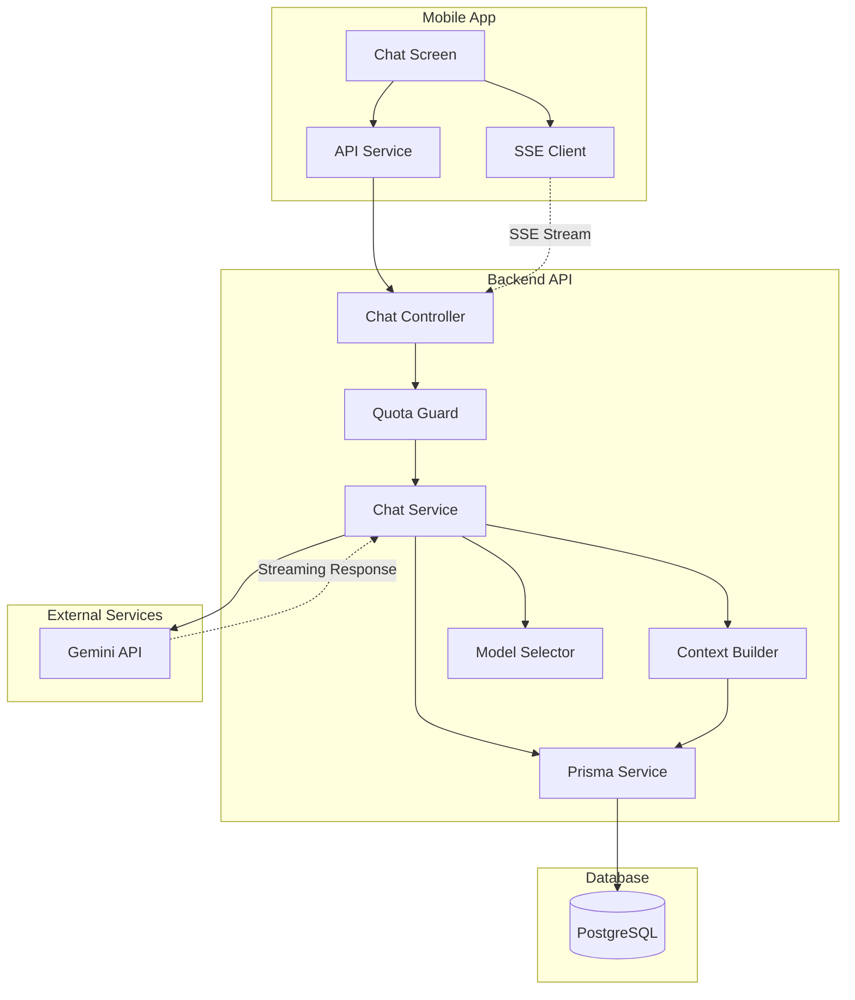

# Design Document

## Overview

Bu tasarım, NOVA AI asistanının Google Gemini API ile entegrasyonunu detaylandırır. Sistem, kullanıcıların sağlık verileri (regl döngüsü, hamilelik, su tüketimi, wellness) ile bağlamsal olarak zenginleştirilmiş, akıllı ve kişiselleştirilmiş sohbetler sunacaktır.

Mevcut altyapı zaten temel chat arayüzü, SSE streaming client, veritabanı modelleri ve model selector servisini içermektedir. Bu tasarım, eksik olan Gemini API entegrasyonu, kişiselleştirilmiş sistem promptu oluşturma, kullanıcı bağlamı toplama ve hata yönetimi mekanizmalarını tamamlayacaktır.

### Teknoloji Stack

- **Backend**: NestJS, Prisma ORM, PostgreSQL
- **AI SDK**: Vercel AI SDK (`ai` package) - Gemini provider (`@ai-sdk/google`)
- **Frontend**: React Native, Expo
- **Streaming**: Server-Sent Events (SSE)
- **Authentication**: JWT

## Architecture

### High-Level Architecture



### Data Flow

1. **User sends message**:
   - Mobile app → POST `/chat/:conversationId/message`
   - Message saved to database
   - Returns message ID

2. **Start streaming**:
   - Mobile app → SSE `/chat/:conversationId/stream`
   - Quota check (QuotaGuard)
   - Context building (user health data)
   - Gemini API call with streaming
   - Tokens streamed to client via SSE
   - Final response saved to database
   - Quota incremented

3. **Forget conversation**:
   - Mobile app → POST `/chat/:conversationId/forget`
   - Delete all messages
   - Delete conversation-scoped memory
   - Return success

## Components and Interfaces

### 1. Context Builder Service

Yeni bir servis oluşturulacak: `ContextBuilderService`

**Sorumluluklar**:
- Kullanıcının sağlık verilerini toplama
- Kişiselleştirilmiş sistem promptu oluşturma
- Kullanıcı tercihlerine göre bağlam filtreleme

**Interface**:

```typescript
interface UserHealthContext {
  // Cycle data
  cycleDay?: number;
  nextPeriodEstimate?: {
    date: string;
    daysUntil: number;
  };
  currentPhase?: 'menstrual' | 'follicular' | 'ovulation' | 'luteal';
  
  // Pregnancy data
  pregnancy?: {
    isActive: boolean;
    weeks: number;
    days: number;
    dueDate: string;
    trimester: number;
  };
  
  // Water intake
  waterToday?: {
    consumed: number;
    target: number;
    percentage: number;
  };
  
  // Wellness data
  wellness?: {
    steps?: { today: number; goal: number };
    meditation?: { todayMin: number; goalMin: number };
    sleep?: { lastNightMin: number; quality?: string };
  };
  
  // User preferences
  language: 'tr' | 'en';
  anonymousMode: boolean;
}

class ContextBuilderService {
  async buildUserContext(userId: string): Promise<UserHealthContext>;
  buildSystemPrompt(context: UserHealthContext): string;
}
```

**Implementation Details**:

```typescript
@Injectable()
export class ContextBuilderService {
  constructor(private readonly prisma: PrismaService) {}

  async buildUserContext(userId: string): Promise<UserHealthContext> {
    const context: UserHealthContext = {
      language: 'tr',
      anonymousMode: false,
    };

    // Fetch user profile
    const user = await this.prisma.user.findUnique({
      where: { id: userId },
      include: { profile: true },
    });

    if (!user) throw new Error('User not found');

    // Get active pregnancy
    const pregnancy = await this.prisma.pregnancy.findFirst({
      where: { userId, isActive: true },
    });

    if (pregnancy) {
      context.pregnancy = this.calculatePregnancyData(pregnancy);
      context.anonymousMode = pregnancy.anonymousMode;
    }

    // Get current cycle
    const currentCycle = await this.prisma.periodCycle.findFirst({
      where: { userId, endDate: null },
      orderBy: { startDate: 'desc' },
    });

    if (currentCycle && !pregnancy) {
      context.cycleDay = this.calculateCycleDay(currentCycle.startDate);
      context.nextPeriodEstimate = await this.estimateNextPeriod(userId);
      context.currentPhase = this.determinePhase(context.cycleDay);
    }

    // Get today's water intake
    const today = new Date();
    today.setHours(0, 0, 0, 0);
    
    const waterLogs = await this.prisma.waterLog.findMany({
      where: {
        userId,
        loggedAt: { gte: today },
      },
    });

    if (waterLogs.length > 0) {
      const consumed = waterLogs.reduce((sum, log) => sum + log.amountMl, 0);
      const target = 2500; // Default, can be customized
      context.waterToday = {
        consumed,
        target,
        percentage: Math.round((consumed / target) * 100),
      };
    }

    // Get wellness data (optional)
    const wellnessPrefs = await this.prisma.wellnessPreferences.findUnique({
      where: { userId },
    });

    if (wellnessPrefs) {
      context.wellness = await this.getWellnessData(userId, wellnessPrefs);
    }

    return context;
  }

  buildSystemPrompt(context: UserHealthContext): string {
    let prompt = `Sen "NOVA"sın, kullanıcının güvenilir sağlık asistanı ve arkadaşısın. Empatik, yargılamayan ve destekleyicisin.

**Önemli Kurallar:**
- Tıp uzmanı değilsin. Asla teşhis koyma.
- Ciddi sağlık endişeleri için profesyonel yardım almayı öner.
- Kullanıcının verilerini gizli tut ve saygılı ol.
- Türkçe konuş, doğal ve samimi bir dil kullan.

**Kullanıcı Bağlamı:**\n`;

    if (context.pregnancy) {
      prompt += `\n🤰 Hamilelik: ${context.pregnancy.weeks} hafta ${context.pregnancy.days} gün (${context.pregnancy.trimester}. trimester)`;
      prompt += `\n   Tahmini doğum tarihi: ${context.pregnancy.dueDate}`;
      if (context.anonymousMode) {
        prompt += `\n   ⚠️ Anonim mod aktif - kişisel bilgileri kaydetme`;
      }
    }

    if (context.cycleDay) {
      prompt += `\n🩸 Regl Döngüsü: ${context.cycleDay}. gün (${context.currentPhase} fazı)`;
      if (context.nextPeriodEstimate) {
        prompt += `\n   Sonraki regl tahmini: ${context.nextPeriodEstimate.daysUntil} gün sonra`;
      }
    }

    if (context.waterToday) {
      prompt += `\n💧 Bugünkü Su Tüketimi: ${context.waterToday.consumed}ml / ${context.waterToday.target}ml (${context.waterToday.percentage}%)`;
      if (context.waterToday.percentage < 50) {
        prompt += ` - Kullanıcıyı su içmeye teşvik edebilirsin`;
      }
    }

    if (context.wellness) {
      prompt += `\n\n**Wellness Verileri:**`;
      if (context.wellness.steps) {
        prompt += `\n🚶 Adımlar: ${context.wellness.steps.today} / ${context.wellness.steps.goal}`;
      }
      if (context.wellness.meditation) {
        prompt += `\n🧘 Meditasyon: ${context.wellness.meditation.todayMin} dakika`;
      }
      if (context.wellness.sleep) {
        prompt += `\n😴 Uyku: ${Math.round(context.wellness.sleep.lastNightMin / 60)} saat`;
        if (context.wellness.sleep.quality) {
          prompt += ` (${context.wellness.sleep.quality})`;
        }
      }
    }

    prompt += `\n\n**Görevlerin:**
- Kullanıcının sorularını yanıtla
- Sağlık ve wellness konularında bilgi ver
- Regl döngüsü, hamilelik, su tüketimi hakkında öneriler sun
- Kullanıcıyı motive et ve destekle
- Gerektiğinde profesyonel yardım almayı öner`;

    return prompt;
  }

  // Helper methods
  private calculateCycleDay(startDate: Date): number {
    const now = new Date();
    const diff = now.getTime() - startDate.getTime();
    return Math.floor(diff / (1000 * 60 * 60 * 24)) + 1;
  }

  private calculatePregnancyData(pregnancy: any) {
    if (!pregnancy.lmpDate) return null;
    
    const lmp = new Date(pregnancy.lmpDate);
    const now = new Date();
    const diffDays = Math.floor((now.getTime() - lmp.getTime()) / (1000 * 60 * 60 * 24));
    const weeks = Math.floor(diffDays / 7);
    const days = diffDays % 7;
    const trimester = weeks < 13 ? 1 : weeks < 27 ? 2 : 3;

    return {
      isActive: pregnancy.isActive,
      weeks,
      days,
      dueDate: pregnancy.dueDate?.toISOString().split('T')[0] || 'Bilinmiyor',
      trimester,
    };
  }

  private determinePhase(cycleDay: number): string {
    if (cycleDay <= 5) return 'menstrual';
    if (cycleDay <= 13) return 'follicular';
    if (cycleDay <= 16) return 'ovulation';
    return 'luteal';
  }

  private async estimateNextPeriod(userId: string) {
    // Simplified - can be enhanced with ML prediction
    const cycles = await this.prisma.periodCycle.findMany({
      where: { userId, endDate: { not: null } },
      orderBy: { startDate: 'desc' },
      take: 3,
    });

    if (cycles.length === 0) return null;

    const avgLength = cycles.reduce((sum, cycle) => {
      const start = new Date(cycle.startDate);
      const end = new Date(cycle.endDate!);
      return sum + Math.floor((end.getTime() - start.getTime()) / (1000 * 60 * 60 * 24));
    }, 0) / cycles.length;

    const lastCycle = cycles[0];
    const nextDate = new Date(lastCycle.startDate);
    nextDate.setDate(nextDate.getDate() + Math.round(avgLength));

    const daysUntil = Math.floor((nextDate.getTime() - Date.now()) / (1000 * 60 * 60 * 24));

    return {
      date: nextDate.toISOString().split('T')[0],
      daysUntil,
    };
  }

  private async getWellnessData(userId: string, prefs: any) {
    const wellness: any = {};

    // Get today's steps
    const today = new Date().toISOString().split('T')[0];
    const steps = await this.prisma.dailySteps.findUnique({
      where: { userId_date: { userId, date: today } },
    });

    if (steps) {
      wellness.steps = {
        today: steps.count,
        goal: prefs.stepsGoal || 10000,
      };
    }

    // Get today's meditation
    const meditations = await this.prisma.meditationSession.findMany({
      where: {
        userId,
        date: today,
      },
    });

    if (meditations.length > 0) {
      wellness.meditation = {
        todayMin: meditations.reduce((sum, m) => sum + m.durationMin, 0),
        goalMin: prefs.meditationGoalMin || 10,
      };
    }

    // Get last night's sleep
    const yesterday = new Date();
    yesterday.setDate(yesterday.getDate() - 1);
    const yesterdayStr = yesterday.toISOString().split('T')[0];

    const sleep = await this.prisma.sleepLog.findUnique({
      where: { userId_sleepDate: { userId, sleepDate: yesterdayStr } },
    });

    if (sleep) {
      wellness.sleep = {
        lastNightMin: sleep.durationMin,
        quality: sleep.quality,
      };
    }

    return Object.keys(wellness).length > 0 ? wellness : undefined;
  }
}
```

### 2. Updated Chat Service

`ChatService` güncellenecek:

**Changes**:
- `ContextBuilderService` inject edilecek
- `streamResponse` metodu Gemini API kullanacak şekilde güncellenecek
- Sistem promptu dinamik olarak oluşturulacak

```typescript
@Injectable()
export class ChatService {
  constructor(
    private readonly prisma: PrismaService,
    private readonly modelSelector: ModelSelectorService,
    private readonly contextBuilder: ContextBuilderService,
  ) {}

  async streamResponse(userId: string, conversationId: string, userMessage: string) {
    // Build user context
    const userContext = await this.contextBuilder.buildUserContext(userId);
    const systemPrompt = this.contextBuilder.buildSystemPrompt(userContext);

    // Get conversation history
    const history = await this.getConversationHistory(conversationId, 10);

    // Build messages array
    const messages = [
      { role: 'system' as const, content: systemPrompt },
      ...history.reverse().map((msg) => ({
        role: msg.role as 'user' | 'assistant',
        content: msg.content,
      })),
      { role: 'user' as const, content: userMessage },
    ];

    // Use Gemini model
    const model = google('gemini-1.5-flash');

    // Stream the response
    const result = streamText({
      model,
      messages,
      temperature: 0.8,
      maxTokens: 2048,
    });

    return result;
  }

  // ... rest of the methods remain the same
}
```

### 3. Environment Configuration

`.env` dosyasına eklenecek:

```bash
# Google Gemini API
GOOGLE_GENERATIVE_AI_API_KEY=your_gemini_api_key_here
```

### 4. Chat Controller Updates

Controller'da minimal değişiklik gerekli - sadece hata mesajları iyileştirilecek:

```typescript
@Sse(':conversationId/stream')
@UseGuards(QuotaGuard)
async stream(
  @CurrentUser() user: any,
  @Param('conversationId') conversationId: string,
  @Req() req: any,
): Promise<Observable<MessageEvent>> {
  // ... existing code ...

  return new Observable((subscriber) => {
    (async () => {
      try {
        const result = await this.chatService.streamResponse(
          user.id,
          conversationId,
          lastMessage.content,
        );

        let fullResponse = '';
        let tokenCount = 0;

        for await (const chunk of result.textStream) {
          fullResponse += chunk;
          tokenCount++;

          subscriber.next({
            type: 'token',
            data: chunk,
          });

          if (abort.signal.aborted) break;
        }

        if (!abort.signal.aborted) {
          await this.chatService.saveMessage(
            conversationId,
            'assistant',
            fullResponse,
            tokenCount,
          );

          await this.quotaService.increment(user.id);

          subscriber.next({
            type: 'done',
            data: JSON.stringify({ tokens: tokenCount }),
          });
        }

        subscriber.complete();
      } catch (error) {
        // Enhanced error handling
        let errorMessage = 'Yanıt alınamadı';
        
        if (error.message?.includes('timeout')) {
          errorMessage = 'İstek zaman aşımına uğradı, lütfen tekrar deneyin';
        } else if (error.message?.includes('rate limit')) {
          errorMessage = 'Sistem yoğun, lütfen birkaç saniye bekleyin';
        } else if (error.message?.includes('API key')) {
          errorMessage = 'API yapılandırma hatası';
        }

        subscriber.next({
          type: 'error',
          data: JSON.stringify({ message: errorMessage }),
        });
        subscriber.error(error);
      }
    })();
  });
}
```

### 5. Quota Guard

Mevcut `QuotaGuard` kullanılacak, ancak hata mesajları iyileştirilecek:

```typescript
@Injectable()
export class QuotaGuard implements CanActivate {
  constructor(private readonly quotaService: QuotaService) {}

  async canActivate(context: ExecutionContext): Promise<boolean> {
    const request = context.switchToHttp().getRequest();
    const user = request.user;

    if (!user) {
      throw new UnauthorizedException('Kimlik doğrulama gerekli');
    }

    const quota = await this.quotaService.getStatus(user.id);

    if (quota.used >= quota.limit) {
      throw new ForbiddenException(
        `Aylık mesaj kotanız doldu (${quota.limit}/${quota.limit}). Yeni ay: ${quota.resetsAt}`,
      );
    }

    return true;
  }
}
```

## Data Models

Mevcut Prisma modelleri kullanılacak:

### Conversation Model
```prisma
model Conversation {
  id         String    @id @default(cuid())
  userId     String
  title      String    @default("New Conversation")
  createdAt  DateTime  @default(now())
  archivedAt DateTime?
  updatedAt  DateTime  @updatedAt

  user     User      @relation(fields: [userId], references: [id], onDelete: Cascade)
  messages Message[]

  @@index([userId, createdAt])
}
```

### Message Model
```prisma
model Message {
  id             String      @id @default(cuid())
  conversationId String
  role           MessageRole // user | assistant | tool
  content        String      @db.Text
  tokens         Int?
  createdAt      DateTime    @default(now())

  conversation Conversation @relation(fields: [conversationId], references: [id], onDelete: Cascade)

  @@index([conversationId, createdAt])
}
```

### UsageQuota Model
```prisma
model UsageQuota {
  id         String   @id @default(cuid())
  userId     String   @unique
  monthKey   String   // Format: YYYY-MM
  aiRequests Int      @default(0)
  limit      Int      @default(100)
  resetsAt   DateTime
  createdAt  DateTime @default(now())
  updatedAt  DateTime @updatedAt

  user User @relation(fields: [userId], references: [id], onDelete: Cascade)

  @@unique([userId, monthKey])
  @@index([userId, monthKey])
}
```

## Error Handling

### Error Types and Responses

| Error Type | HTTP Status | User Message (TR) | Action |
|------------|-------------|-------------------|--------|
| API Key Missing | 500 | "Sistem yapılandırma hatası" | Log error, notify admin |
| Timeout | 504 | "Yanıt alınamadı, lütfen tekrar deneyin" | Retry suggestion |
| Rate Limit | 429 | "Sistem yoğun, lütfen birkaç saniye bekleyin" | Wait and retry |
| Quota Exceeded | 403 | "Aylık mesaj kotanız doldu" | Show upgrade option |
| Network Error | 503 | "Bağlantı hatası, internet bağlantınızı kontrol edin" | Retry suggestion |
| Invalid Request | 400 | "Geçersiz istek" | Show error details |
| Unauthorized | 401 | "Oturum süresi doldu, lütfen tekrar giriş yapın" | Redirect to login |

### Error Logging

```typescript
private logError(error: Error, context: string, userId?: string) {
  console.error(`[${context}] Error:`, {
    message: error.message,
    stack: error.stack,
    userId,
    timestamp: new Date().toISOString(),
  });

  // In production, send to error tracking service (e.g., Sentry)
  if (process.env.NODE_ENV === 'production') {
    // Sentry.captureException(error, { user: { id: userId }, tags: { context } });
  }
}
```

## Testing Strategy

### Unit Tests

1. **ContextBuilderService Tests**:
   - Test context building with different user states (pregnant, cycling, neither)
   - Test system prompt generation
   - Test edge cases (no data, partial data)

2. **ChatService Tests**:
   - Mock Gemini API responses
   - Test message saving
   - Test conversation history retrieval
   - Test error handling

3. **QuotaGuard Tests**:
   - Test quota enforcement
   - Test quota increment
   - Test reset logic

### Integration Tests

1. **End-to-End Chat Flow**:
   - Send message → Stream response → Save to DB
   - Test with real Gemini API (staging environment)
   - Verify quota increment

2. **SSE Streaming**:
   - Test connection establishment
   - Test token streaming
   - Test connection abort
   - Test error scenarios

### Manual Testing Checklist

- [ ] Send first message in new conversation
- [ ] Send multiple messages in same conversation
- [ ] Test streaming with slow network
- [ ] Test "Stop" button during streaming
- [ ] Test "Forget" conversation
- [ ] Test quota limit enforcement
- [ ] Test with pregnant user context
- [ ] Test with cycling user context
- [ ] Test with wellness data
- [ ] Test error scenarios (timeout, rate limit)
- [ ] Test on iOS and Android

## Performance Considerations

### Optimization Strategies

1. **Database Queries**:
   - Use indexes on `conversationId`, `userId`, `createdAt`
   - Limit conversation history to last 10 messages
   - Use `select` to fetch only needed fields

2. **Context Building**:
   - Cache user context for 5 minutes (Redis in future)
   - Parallel queries where possible
   - Skip wellness data if not enabled

3. **Streaming**:
   - Buffer tokens on client (512 chars or 50ms)
   - Use compression for SSE (gzip)
   - Implement connection pooling

4. **API Calls**:
   - Set reasonable timeout (30s)
   - Implement retry logic with exponential backoff
   - Monitor API usage and costs

### Monitoring Metrics

- Average response time (first token)
- Total tokens per request
- Error rate by type
- Quota usage per user
- API cost per day/month

## Security Considerations

### Data Privacy

1. **PII Protection**:
   - Never send user email or full name to Gemini
   - Use anonymous IDs in logs
   - Encrypt sensitive data in database

2. **Authentication**:
   - JWT required for all chat endpoints
   - Verify conversation ownership
   - Rate limiting per user

3. **API Key Security**:
   - Store in environment variables
   - Never log API keys
   - Rotate keys periodically

### Content Safety

1. **Input Validation**:
   - Max message length: 500 characters
   - Sanitize user input
   - Block malicious content

2. **Output Filtering**:
   - Monitor for inappropriate responses
   - Implement content moderation if needed

## Deployment Checklist

- [ ] Set `GOOGLE_GENERATIVE_AI_API_KEY` in environment
- [ ] Run database migrations (if any)
- [ ] Deploy backend with new code
- [ ] Test API endpoints in staging
- [ ] Deploy mobile app update
- [ ] Monitor error logs for 24 hours
- [ ] Check API usage and costs
- [ ] Verify quota system working
- [ ] Test with real users (beta group)

## Future Enhancements

1. **Multi-turn Context**:
   - Implement conversation summarization for long chats
   - Use embeddings for semantic search in history

2. **Tool Calling**:
   - Enable Gemini function calling
   - Implement tools: log water, create reminder, get cycle prediction

3. **Voice Input**:
   - Add speech-to-text for voice messages
   - Text-to-speech for responses

4. **Multiple Conversations**:
   - Allow users to create multiple chat threads
   - Implement conversation search

5. **Analytics**:
   - Track user engagement
   - Identify common questions
   - Improve system prompts based on feedback
